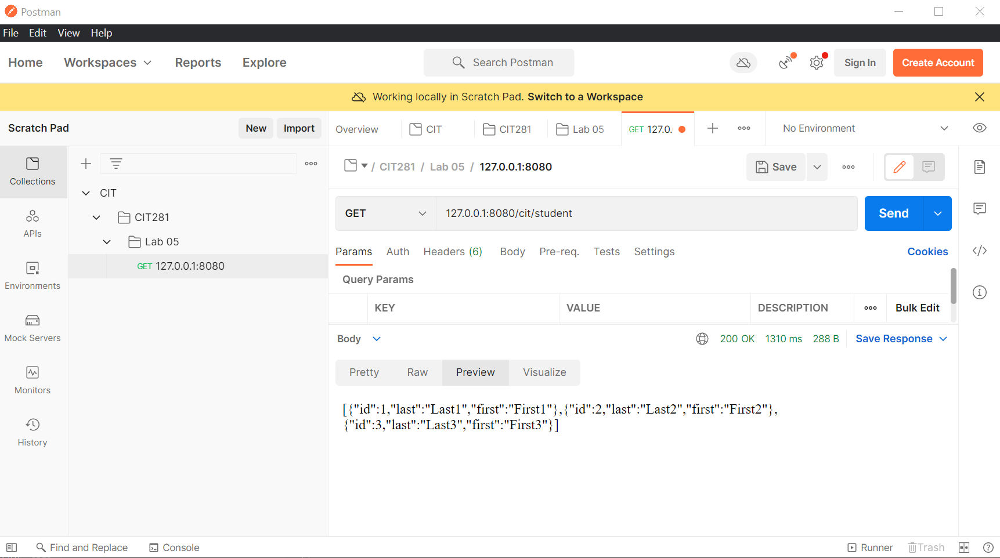
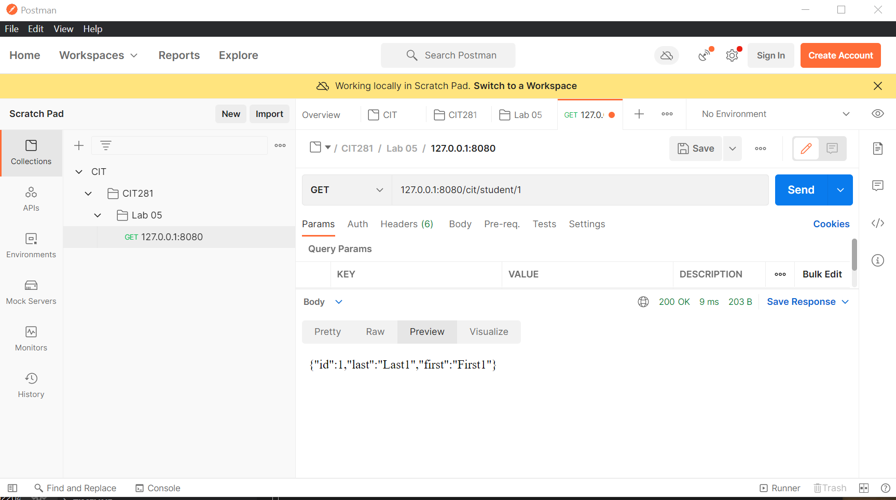
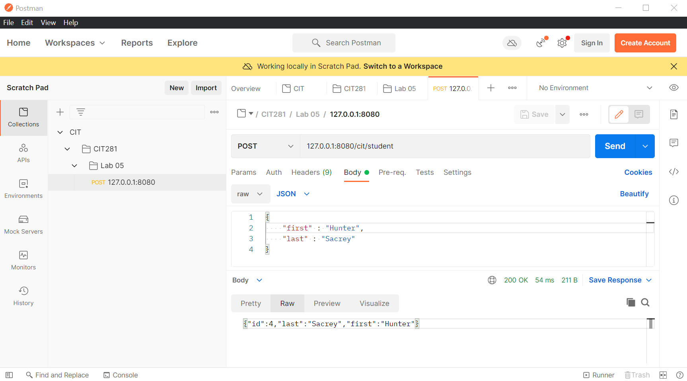
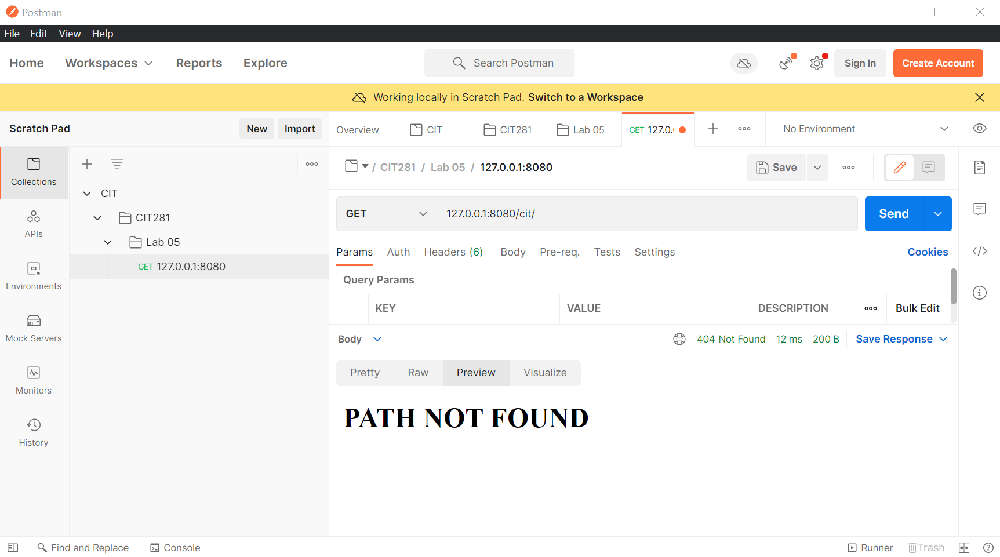

## Lab 5

In this lab, I used Postman to create a CIT 281 collection and folders.

I also created a Node.js Fastify server application with GET and post handling that responds with JSON.

I used Postman to test server GET routes and to send a POST.

I had an array of Student objects the following route options: view all students, view a specific student by id, and an unmatched route

#### All students:

#### Specific Student:

#### Posting a Student:

#### Unmatched route:

